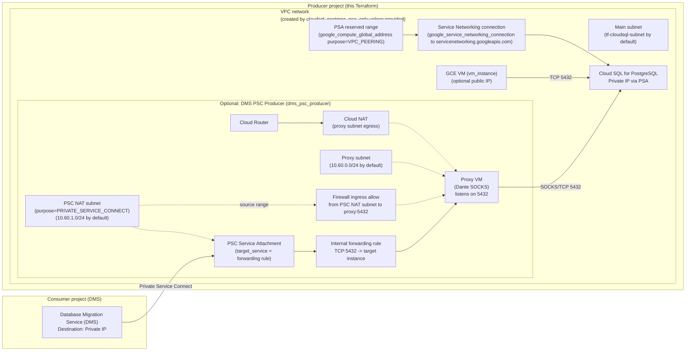

# gcp-terraform-cloud-sql

This repo is set up to run as a Terraform root module and includes a reusable module that creates a Cloud SQL for PostgreSQL instance using PSA and/or PSC.

## What it deploys

- `module.postgres`: a Cloud SQL for PostgreSQL instance (private IP via PSA)
- `modules/vm_instance`: a minimal-cost GCE VM module (optional)
- `modules/dms_psc_producer`: optional PSC producer setup for DMS destination private IP connectivity (keeps Cloud SQL itself non-PSC-enabled)

## Networking (diagram)

The diagram below reflects the networking resources created by this repo:

- Cloud SQL uses **Private Service Access (PSA)** (Service Networking) to get a private IP in your VPC
- The VM is placed in the same VPC/subnet so it can reach the Cloud SQL private IP
- Optional: the `dms_psc_producer` module creates a **PSC service attachment** backed by an internal forwarding rule to a small proxy VM, so **DMS can connect privately** without enabling PSC on the Cloud SQL instance

## Using Terraform Cloud (terraform.io) with VCS integration

1. Create a new Workspace in Terraform Cloud and choose **Version Control Workflow**.
2. Connect this GitHub repo and set the workspace working directory to the repo root.
3. Configure GCP authentication in Terraform Cloud.

### Auth options

**Option A: Service Account JSON (simplest to start)**

- Create a GCP service account with permissions to create Cloud SQL instances and set up service networking.
- In Terraform Cloud workspace variables, add an **Environment Variable**:
  - `GOOGLE_CREDENTIALS` = *(paste the full JSON key contents)*

**Option B: Workload Identity Federation (recommended long-term)**

Use Terraform Cloud's OIDC integration with a Google Cloud Workload Identity Provider. This avoids long-lived JSON keys.

## Required Terraform variables

Set these as **Terraform Variables** in the workspace:

- `project_id` (string) — your GCP project ID
- `cloudsql_instance_name` (string) — defaults to `tf-pg-demo`

Optional:

- `region` (string) — defaults to `us-central1`

## Local usage (optional)

If you want to run locally:

- Install Terraform >= 1.5
- Authenticate to GCP (Application Default Credentials), or export `GOOGLE_CREDENTIALS`
- If using google credentials, save the json credentials to a location and run `setx GOOGLE_APPLICATION_CREDENTIALS "[..Full_Path..]\gcp-sa.json"`

Then:

- `terraform init`
- `terraform plan`
- `terraform apply`

## Module

See `modules/cloudsql_postgres_psa_psc` for the reusable Cloud SQL module.
See `modules/cloudsql_postgres_psa_only` for the reusable Cloud SQL module.

## DMS to Cloud SQL (private IP destination, Cloud SQL NOT PSC-enabled)

If you need Database Migration Service (DMS) to migrate **into** a Cloud SQL private IP instance **without enabling PSC on the Cloud SQL instance**, this repo includes an optional PSC producer setup.

- Enable it by setting `dms_psc_producer_enabled=true`.
- After apply, use `dms_psc_service_attachment_uri` output when creating the **destination** connection profile in the DMS Console (Private IP).

Note: as of `hashicorp/google` provider v7.17.0, Terraform does not expose the DMS fields needed to attach a destination connection profile to a PSC service attachment for PostgreSQL, so the final DMS destination connection profile step is currently manual.
